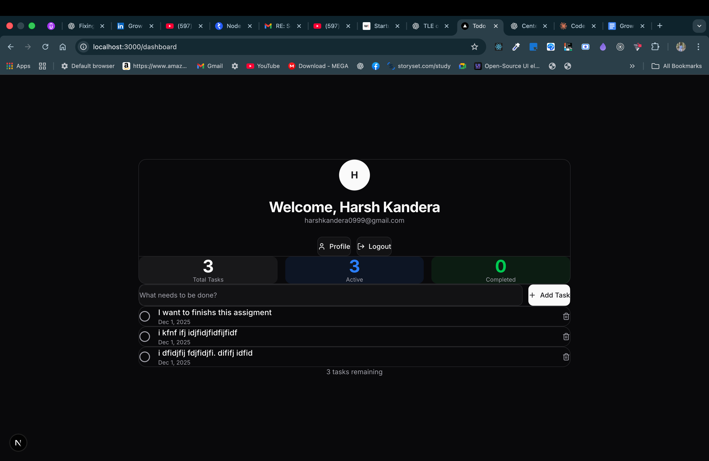
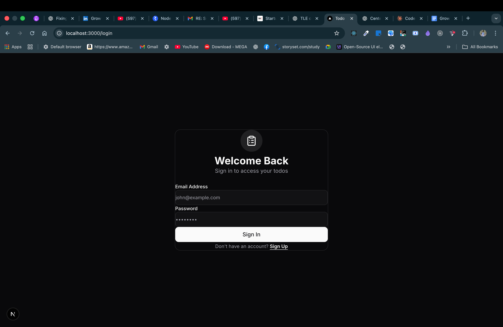

# Full-Stack Todo Application

A complete todo application with FastAPI backend and Next.js frontend, featuring user authentication, CRUD operations, and a premium dark theme UI.

## 📋 Overview

This project consists of two separate applications:

1. **Backend** - Python FastAPI REST API with JWT authentication and SQLite database
2. **Frontend** - Next.js TypeScript application with modern UI design

## ✨ Features

### Backend Features
- User registration and authentication with JWT tokens
- Password hashing with bcrypt
- RESTful API endpoints for todos and users
- SQLite database with SQLAlchemy ORM
- CORS configuration for frontend
- Automatic API documentation (Swagger/ReDoc)

### Frontend Features
- Modern dark theme with glassmorphism design
- User signup and login with form validation
- Protected routes with automatic redirection
- Todo management (add, complete, delete)
- User profile page with statistics
- Real-time UI updates
- Responsive design

## 🚀 Quick Start

### Prerequisites

- Python 3.8 or higher
- Node.js 18.x or higher
- npm (comes with Node.js)

### Backend Setup

```bash
# Navigate to backend directory
cd backend

# Create virtual environment (recommended)
python -m venv venv
source venv/bin/activate  # On Windows: venv\Scripts\activate

# Install dependencies
pip install -r requirements.txt

# Run the server
uvicorn main:app --reload
```

Backend will run at **http://localhost:8000**

### Frontend Setup

```bash
# Navigate to frontend directory
cd frontend

# Install dependencies
npm install

# Run development server
npm run dev
```

Frontend will run at **http://localhost:3000**

## 📁 Project Structure

```
Assignment/
├── backend/                 # FastAPI backend
│   ├── main.py             # App entry point
│   ├── database.py         # Database configuration
│   ├── models.py           # SQLAlchemy models
│   ├── schemas.py          # Pydantic schemas
│   ├── auth.py             # JWT utilities
│   ├── routers/
│   │   ├── auth.py         # Auth endpoints
│   │   └── todos.py        # Todo endpoints
│   ├── requirements.txt    # Python dependencies
│   └── README.md           # Backend documentation
│
├── frontend/               # Next.js frontend
│   ├── src/
│   │   ├── app/
│   │   │   ├── login/      # Login/Signup page
│   │   │   ├── dashboard/  # Todo dashboard
│   │   │   ├── profile/    # User profile
│   │   │   └── globals.css # Styles
│   │   └── lib/
│   │       └── api.ts      # API client
│   ├── package.json
│   └── README.md           # Frontend documentation
│
└── README.md               # This file
```

## 🔌 API Endpoints

### Authentication
- `POST /api/auth/signup` - Register new user
- `POST /api/auth/login` - Login user
- `GET /api/auth/profile` - Get user profile

### Todos
- `GET /api/todos` - Get all todos (protected)
- `POST /api/todos` - Create todo (protected)
- `PATCH /api/todos/{id}` - Update todo (protected)
- `DELETE /api/todos/{id}` - Delete todo (protected)

## 🗄️ Database Schema

**Users Table**
- id, name, email, hashed_password, created_at

**Todos Table**
- id, title, completed, user_id, created_at

## 🧪 Testing

### Test Backend API

```bash
# Signup
curl -X POST http://localhost:8000/api/auth/signup \
  -H "Content-Type: application/json" \
  -d '{"name":"Test User","email":"test@example.com","password":"password123"}'

# Login
curl -X POST http://localhost:8000/api/auth/login \
  -H "Content-Type: application/json" \
  -d '{"email":"test@example.com","password":"password123"}'

# Create Todo (use token from login)
curl -X POST http://localhost:8000/api/todos \
  -H "Authorization: Bearer YOUR_TOKEN" \
  -H "Content-Type: application/json" \
  -d '{"title":"Test todo"}'
```

### Test Frontend

1. Open http://localhost:3000
2. Create an account
3. Add todos
4. Mark todos complete/incomplete
5. Delete todos
6. View profile
7. Logout and login again

## 📚 Documentation

- **Backend API Docs**: http://localhost:8000/docs (Swagger UI)
- **Backend README**: [backend/README.md](backend/README.md)
- **Frontend README**: [frontend/README.md](frontend/README.md)

Detailed setup instructions, API documentation with cURL examples, and testing guides are available in the respective README files.

## 🛠️ Technology Stack

### Backend
- FastAPI (Web framework)
- SQLAlchemy (ORM)
- SQLite (Database)
- Pydantic (Validation)
- python-jose (JWT)
- passlib (Password hashing)

### Frontend
- Next.js 15 (React framework)
- TypeScript
- Tailwind CSS
- Google Fonts (Inter)

## 🎯 Assignment Requirements

✅ All 3 frontend pages working (Login, Dashboard, Profile)  
✅ User signup functionality  
✅ User login functionality  
✅ Create todos  
✅ Mark todos complete/incomplete  
✅ Delete todos  
✅ View user profile  
✅ Logout functionality  
✅ All backend API endpoints working  
✅ Clean, organized code  
✅ Complete documentation in READMEs  
✅ API cURL commands in backend README  

## 📝 Notes

- JWT tokens expire after 7 days
- Each user can only access their own todos
- SQLite database is created automatically on first run
- CORS is configured to allow requests from http://localhost:3000

## 🔒 Security

- Passwords are hashed using bcrypt before storage
- JWT tokens for secure authentication
- Protected API routes require valid tokens
- User isolation (users can only access their own data)

## 🚀 Deployment

### Backend Deployment
- Deploy to platforms like Heroku, Railway, or Render
- Update SECRET_KEY in production
- Consider using PostgreSQL instead of SQLite

### Frontend Deployment
- Deploy to Vercel, Netlify, or AWS Amplify
- Update `NEXT_PUBLIC_API_URL` to production backend URL
- Build with `npm run build`

## 📧 Submission

**GitHub Repositories**:
- Backend: Contains FastAPI code with README and cURL commands
- Frontend: Contains Next.js code with README and screenshots

**Email to**: varun@groweasy.ai

**Include**:
- Both GitHub repository links
- Your name and contact information

---

**Developed for Assignment Submission**

Built with Python FastAPI and Next.js




